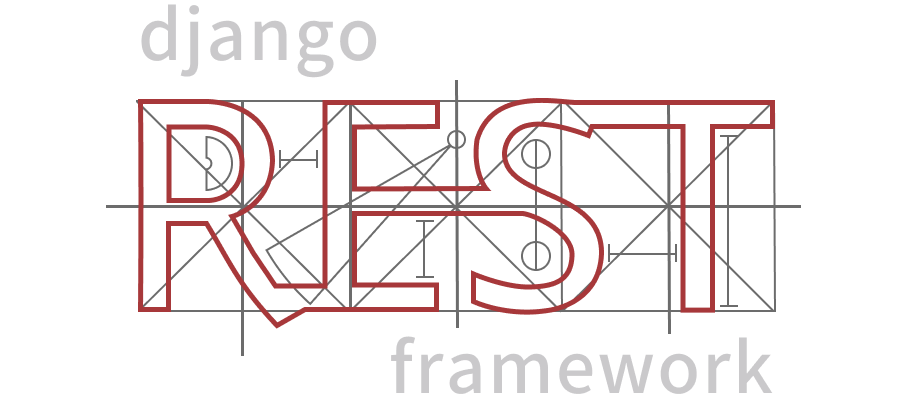

# Hi, Gabriel here! Welcome to my Github profile👋

## Full Stack Developer 

### Python • Django • TypeScript • Angular • Flutter

| ⭐ Favorite technologies | 📱 Mobile |🎨 Front-end & UI/UX | ⚙️ Back-end | 🗄️ Infrastructure |
| :--- | :---: | :---: | :---: | :---: |
|

||

|

|

|

    </img>

